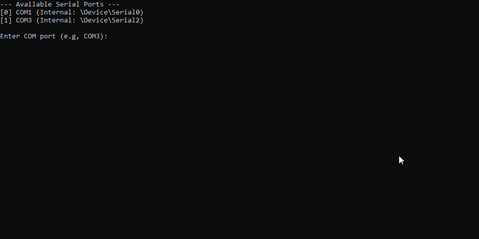
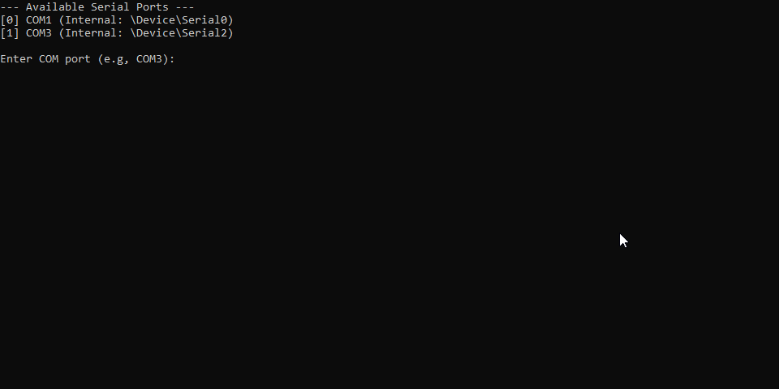

# ESP32 Host Tool




A lightweight, native Windows CLI utility designed to interact with the ESP32 UART CLI Firmware.

# About The Project
A standalone host application, all written in **Pure C** using the **Win32 API**.

While the firmware runs on the chip, this tool runs on your computer. It avoids external dependencies like Python or Node.js by compiling into a single, portable executable. It bundles the flashing tools and firmware binary (sourced from **[esp32-uart-cli](https://github.com/abduznik/esp32-uart-cli)**) directly inside the `.exe` using Windows Resource files, making deployment instant.

## Tech Usage
* **Language:** C (Standard C using `<windows.h>`)
* **API:** Native Win32 API (File I/O, Threads, Registry)
* **Build System:** GCC (MinGW) & Windres
* **Target Firmware:** [esp32-uart-cli](https://github.com/abduznik/esp32-uart-cli)

## Features
* **Registry-Based Detection:** Scans the Windows Registry (`HARDWARE\DEVICEMAP\SERIALCOMM`) to automatically list available COM ports.
* **Multithreaded Monitor:** Spawns a dedicated thread (`CreateThread`) to handle asynchronous serial reading while keeping the CLI responsive.
* **Self-Contained Flashing:** The `esptool` executable and `firmware.bin` are embedded into the tool's resources and extracted to a temporary directory only when needed.
* **Automated Logic:** Wraps the complex command-line arguments for flashing into a single menu selection.

# Getting Started

## Prerequisites
* **MinGW/GCC** installed (for building from source).
* **Physical Hardware:** An ESP32 via USB.
* **External Files:** You must have `esptool.exe` and `firmware.bin` (from the [firmware repo](https://github.com/abduznik/esp32-uart-cli)) in the root directory to compile the resources.

## Build And Run
1.  **Clone the repo:**
    ```bash
    git clone [https://github.com/abduznik/esp32-host-tool.git](https://github.com/abduznik/esp32-host-tool.git)
    ```
2.  **Compile Resources:**
    Bundle the binary files into an object file:
    ```bash
    windres resources.rc -o resources.o
    ```
3.  **Compile Executable:**
    Link the C code with the resource object:
    ```bash
    gcc main.c resources.o -o SerialManagerTool.exe -static
    ```

# Usage
Run `SerialManagerTool.exe`.
The tool will list available ports and prompt for a selection.

| Option | Description |
| :--- | :--- |
| **1. Serial Monitor** | Opens a real-time terminal to view ESP32 output and send commands. |
| **2. Flash Firmware** | Unpacks internal resources and automatically flashes the embedded firmware to the selected port. |