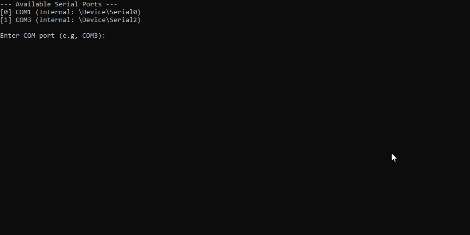
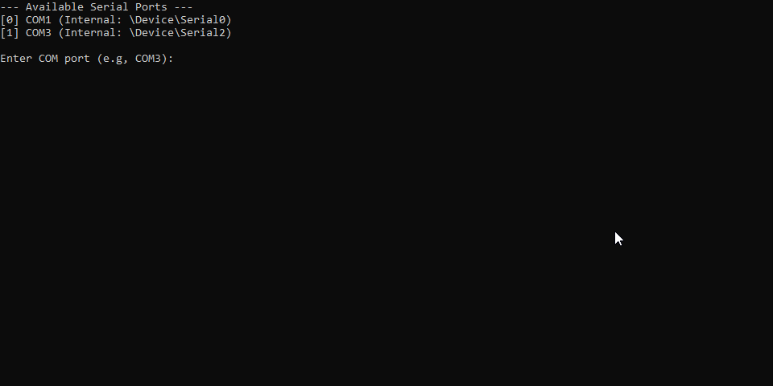

# ESP32 Host Tool




A lightweight, cross-platform CLI companion tool for ESP32 devices, written in **Pure C**. 

Decoupled from hardcoded firmware and esptool binaries, it is a generic utility for flashing any `.bin` firmware and interacting with the ESP32 serial interface.

## Supported Platforms
- **Windows** (using Win32 API and Registry scanning)
- **Linux** (using termios serial communications and POSIX threads)
- **macOS** (using termios with IOKit high baud-rate support and POSIX threads)

---

## Tech Stack
* **Language:** Pure C (no C++)
* **Dependencies:** None (zero external libraries; uses native OS primitives: Win32 API on Windows, POSIX `pthread`/`termios`/`glob` on Linux/macOS)
* **Build System:** Makefile with automatic platform detection (works with GCC/Clang on Unix, and MinGW on Windows)

---

## Features
* **Cross-Platform Port Detection:** 
  - **Windows:** Scans the Registry (`HARDWARE\DEVICEMAP\SERIALCOMM`)
  - **Linux:** Scans `/dev/ttyUSB*` and `/dev/ttyACM*`
  - **macOS:** Scans `/dev/cu.usbserial*` and `/dev/cu.SLAB*`
* **Multithreaded Monitor:** Handles asynchronous serial reading in a dedicated background thread while keeping CLI inputs active and responsive.
* **Generalized Flashing:** Invokes system `esptool` automatically with custom `.bin` paths, wrapping arguments behind the scenes. Works with any firmware!
* **Dual Interface Mode:** Full CLI-argument driven interface with automatic fallback to the classic interactive selection menu.

---

## CLI Interface & Usage

### 1. List Available Serial Ports
Lists all detected serial devices on the system.
```bash
./esp32-tool ports
```

### 2. Serial Monitor
Opens a real-time monitor on the specified port. Optionally set the baud rate (defaults to 115200).
```bash
./esp32-tool monitor <port> [--baud 115200]
```

### 3. Flash Arbitrary Firmware
Flashes the specified `.bin` file to the destination port using `esptool`.
```bash
./esp32-tool flash <port> <path/to/firmware.bin>
```
> [!NOTE]
> You must have `esptool` installed and available on your system `PATH`. Alternatively, pass its path explicitly by setting the `ESPTOOL` environment variable, e.g., `export ESPTOOL=/path/to/esptool`.

### 4. Interactive Menu (Fallback)
Running the tool without arguments drops into the classic interactive selection menu.
```bash
./esp32-tool
```

---

## Getting Started & Compilation

### Prerequisites
- **GCC / Clang** (for Linux/macOS)
- **MinGW-w64** (for Windows)
- **esptool** (on system `PATH` or configured via `ESPTOOL` env var)

### Building
The included `Makefile` automatically detects your operating system and sets up the correct build flags and link dependencies:

```bash
# Clone the repository
git clone https://github.com/abduznik/esp32-host-tool.git
cd esp32-host-tool

# Build the executable
make
```

To clean up build outputs:
```bash
make clean
```